# Incentive-based-Probability-Update-and-Strategy-Selection

## 01 文件结构

```
Incentive-based-Probability-Update-and-Strategy-Selection
├─ LICENSE
├─ README.md
├─ algorithm
│	├─ IPUSS.py
│	├─ IPUSS_ver2.py
│	├─ __init__.py
│	├─ random_selection.py
│	├─ water_filling.py
│	└─ x.py
├─ config
│	├─ __init__.py
│	├─ config.py
│	└─ settings.py
├─ data
│	├─ data.csv
│	├─ fill_xy.csv
│	├─ init.csv
│	├─ task.csv
│	└─ xy_data.csv
├─ draw
│	├─ __init__.py
│	├─ draw_csv_to_map.py
│	├─ draw_roadnetwork.py
│	└─ roadNetwork.png
├─ experiment
│	├─ __init__.py
│	├─ experiment_init.py
│	├─ experiment_save_and_reload.py
│	├─ one_slot_experiment.py
│	├─ one_slot_experiment_ver2.py
│	├─ one_slot_experiment_ver2_11.py
│	├─ one_slot_experiment_ver2_12.py
│	├─ one_slot_experiment_ver2_13.py
│	├─ one_slot_experiment_ver2_15.py
│	├─ one_slot_experiment_ver2_9.py
│	└─ one_slot_experiment_ver3.py
├─ experiment_data
│	├─ .DS_Store
│	├─ experiment_file_name.txt
│	├─ experiment_input
│	│	├─ Experiment_02_2020-08-31 19:51:02.pkl
│	│	├─ Experiment_05_2020-08-31 19:32:03.pkl
│	│	├─ Experiment_100_2020-08-30 10:19:35.pkl
│	│	├─ Experiment_16_2020-08-31 19:28:42.pkl
│	│	├─ Experiment_20_2020-08-31 16:27:52.pkl
│	│	├─ Experiment_20_2020-08-31 20:18:29.pkl
│	│	├─ Experiment_21_2020-09-02 21:32:36.pkl
│	│	├─ Experiment_26_2020-08-31 19:23:29.pkl
│	│	├─ Experiment_26_2020-08-31 19:45:56.pkl
│	│	├─ Experiment_29_2020-08-31 17:09:36.pkl
│	│	├─ Experiment_45_2020-08-29 17:18:46.pkl
│	│	├─ Experiment_57_2020-08-30 14:01:42.pkl
│	│	├─ Experiment_61_2020-08-31 19:19:43.pkl
│	│	├─ Experiment_62_2020-08-30 13:44:03.pkl
│	│	├─ Experiment_68_2020-08-30 09:53:33.pkl
│	│	├─ Experiment_79_2020-08-31 19:39:14.pkl
│	│	├─ Experiment_82_2020-08-31 15:11:39.pkl
│	│	├─ Experiment_90_2020-08-31 17:40:17.pkl
│	│	├─ Experiment_90_2020-08-31 18:52:52.pkl
│	│	└─ Experiment_94_2020-08-31 19:35:33.pkl
│	├─ experiment_median
│	│	├─ Experiment_06_2020-09-02 17:08:30.pkl
│	│	├─ Experiment_51_2020-09-02 21:34:05.pkl
│	│	├─ Experiment_70_2020-09-01 11:17:15.pkl
│	│	├─ Experiment_72_2020-09-01 14:42:59.pkl
│	│	└─ Experiment_83_2020-09-01 02:55:24.pkl
│	├─ experiment_median_file_name.txt
│	└─ experiment_output
│	 	├─ .DS_Store
│	 	├─ iteration_results_ver2.json
│	 	├─ iteration_results_ver2_11.json
│	 	├─ iteration_results_ver2_12.json
│	 	├─ iteration_results_ver2_13.json
│	 	├─ iteration_results_ver2_15.json
│	 	├─ iteration_results_ver2_9.json
│	 	└─ iteration_results_ver3.json
├─ experiment_results
│	├─ __init__.py
│	├─ converage_analytics.py
│	├─ get_compara_evaluation.py
│	├─ get_ipus_evaluation.py
│	├─ get_ipus_evaluation_09.py
│	├─ get_ipus_evaluation_11.py
│	├─ get_ipus_evaluation_12.py
│	├─ get_ipus_evaluation_13.py
│	├─ get_ipus_evaluation_15.py
│	├─ get_results.py
│	├─ one_list.csv
│	├─ one_list2.csv
│	├─ out.csv
│	├─ out.xlsx
│	├─ results_analytics.py
│	└─ strategy_evaluation.py
├─ gpsProcess
│	├─ __init__.py
│	├─ gps2data.py
│	└─ gps2xy.py
├─ img
│	├─ .DS_Store
│	├─ experiment_edge_node_setup.jpg
│	└─ map.png
├─ init_input
│	├─ __init__.py
│	├─ experiment_input_save_and_reload.py
│	├─ init_distance.py
│	├─ init_edge_node.py
│	├─ init_task_by_time.py
│	├─ init_vehicles.py
│	└─ read_experiment.py
└─ outputImage
	└─ __init__.py

```
## 02 简介PPT

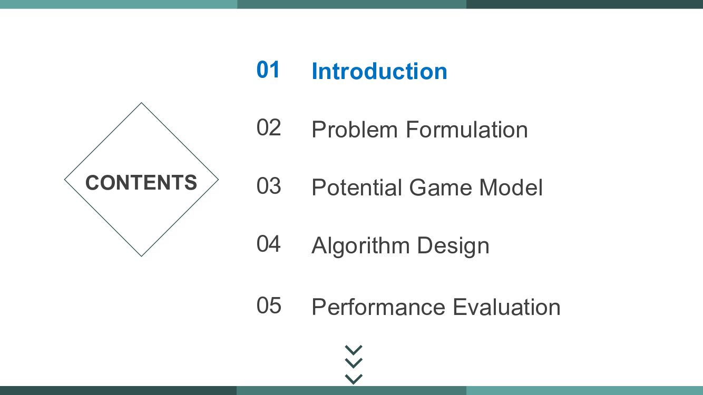
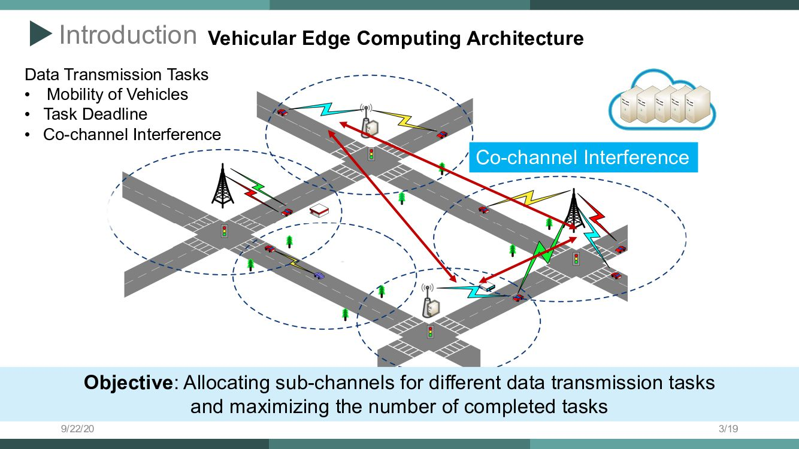
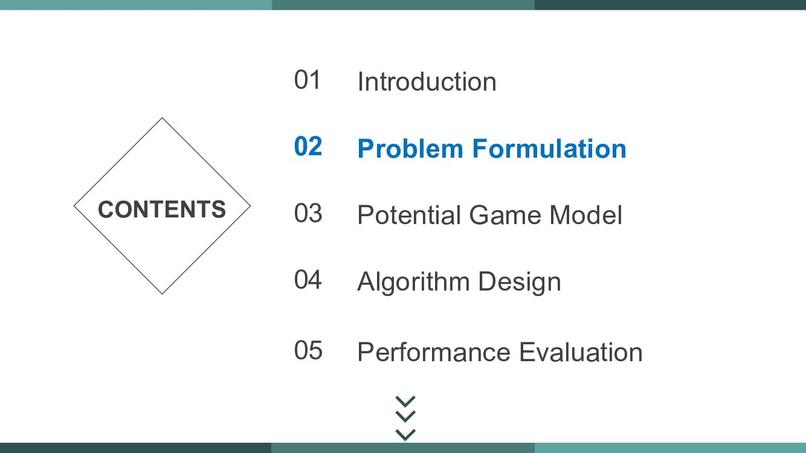
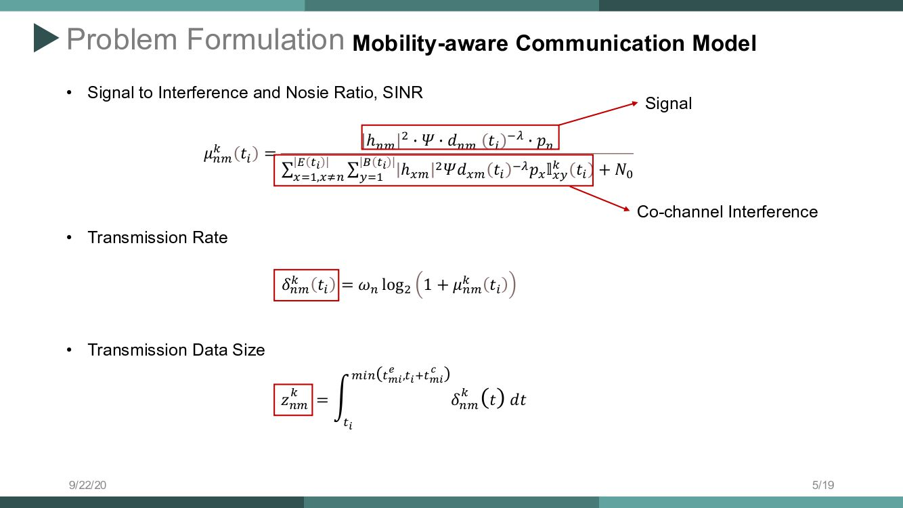
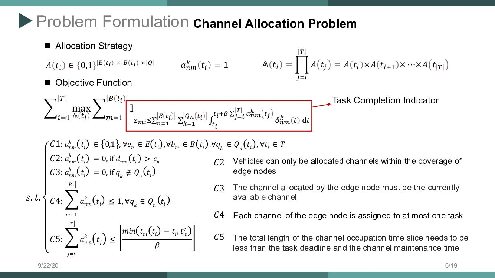
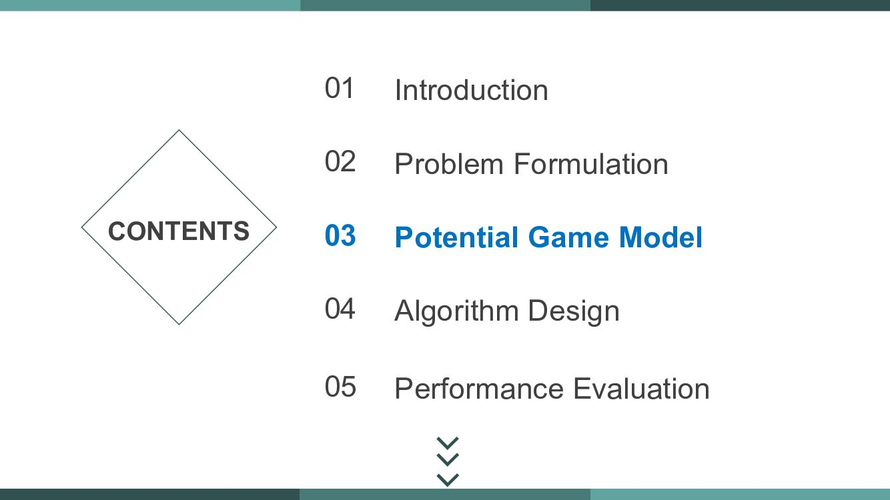
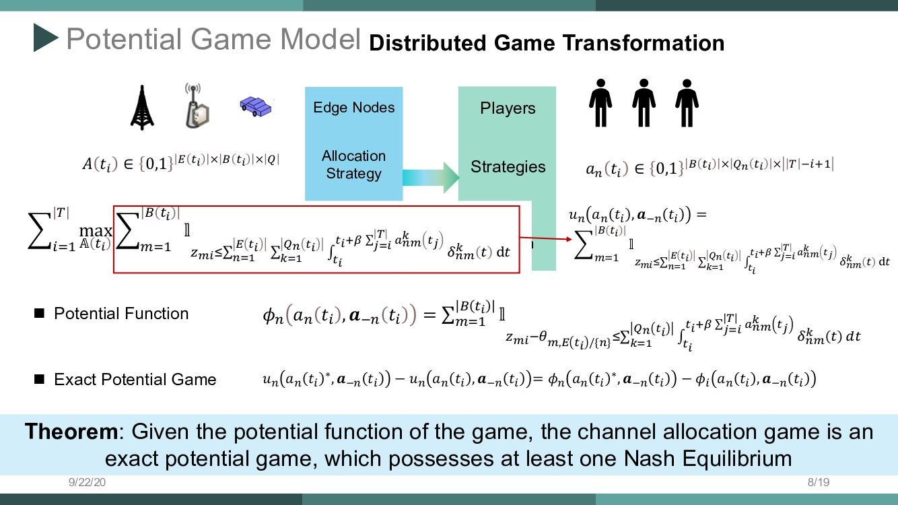
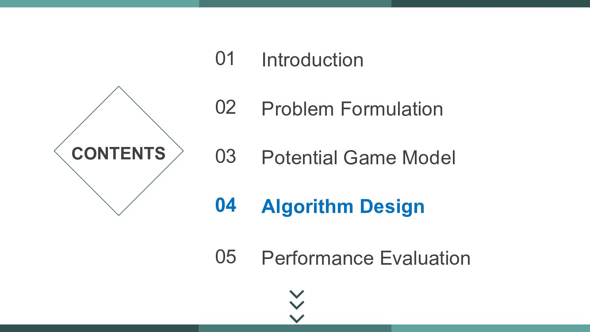
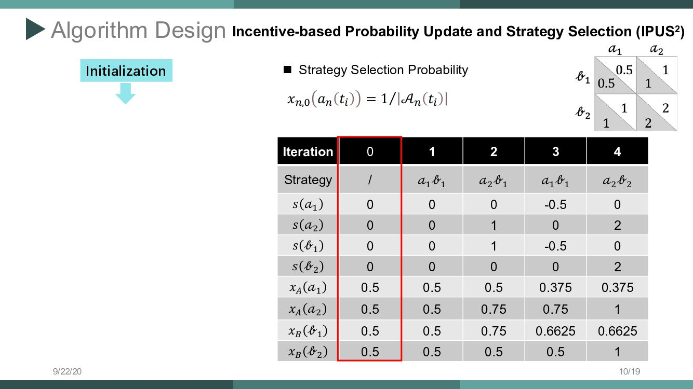
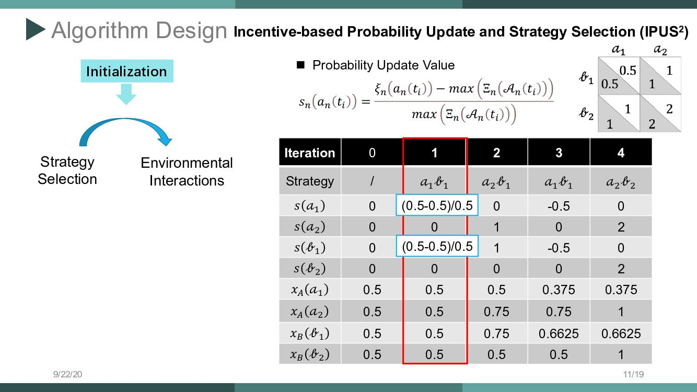
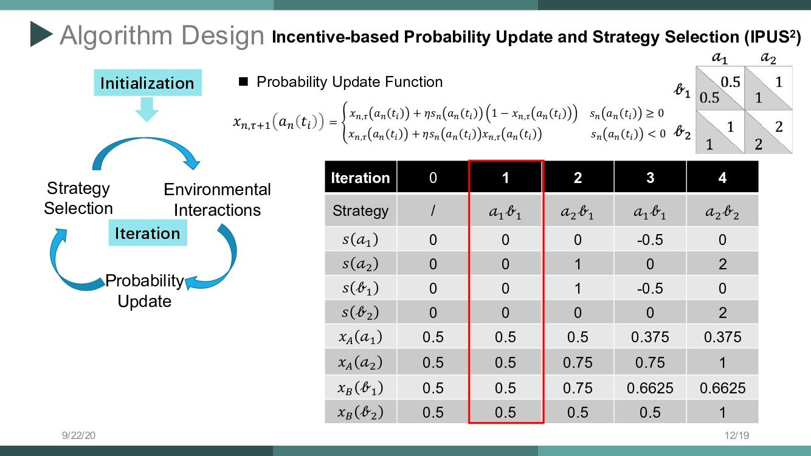
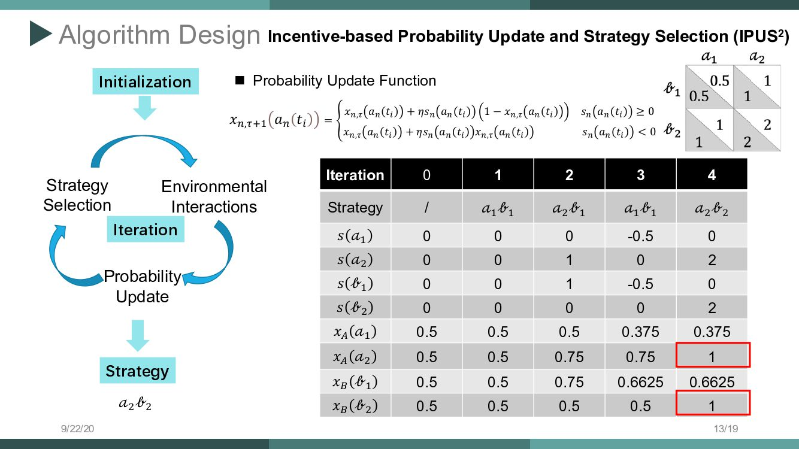
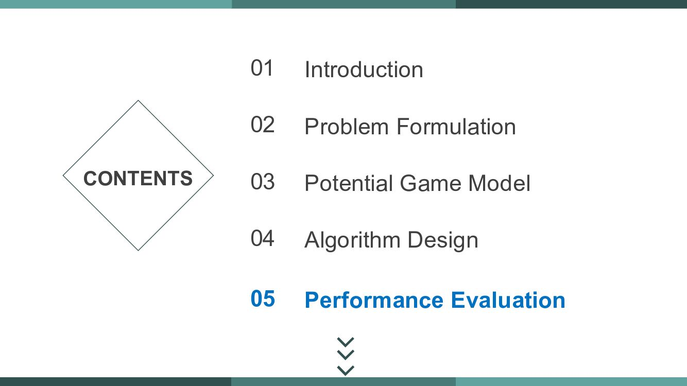
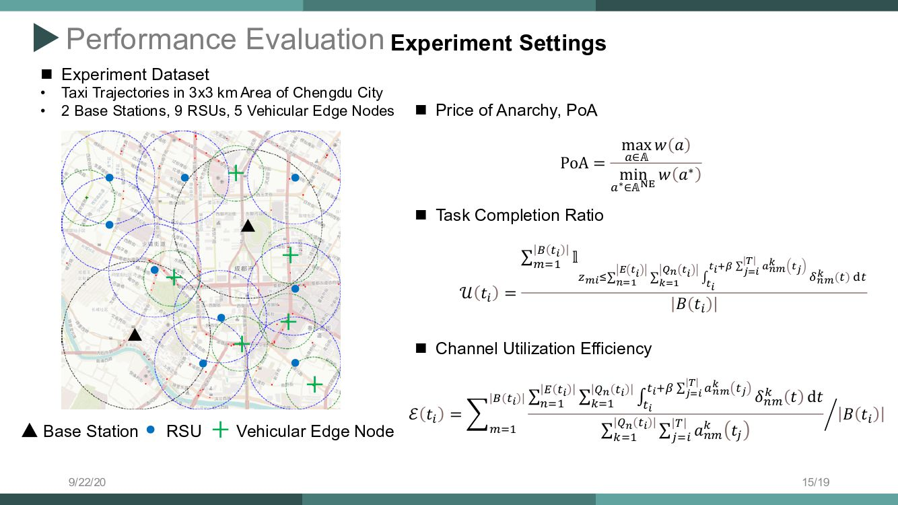
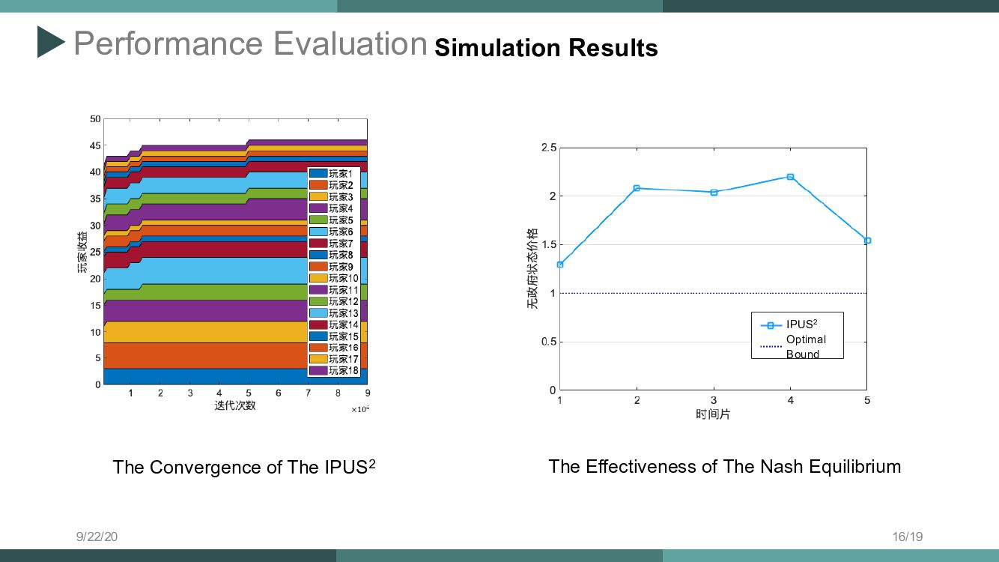
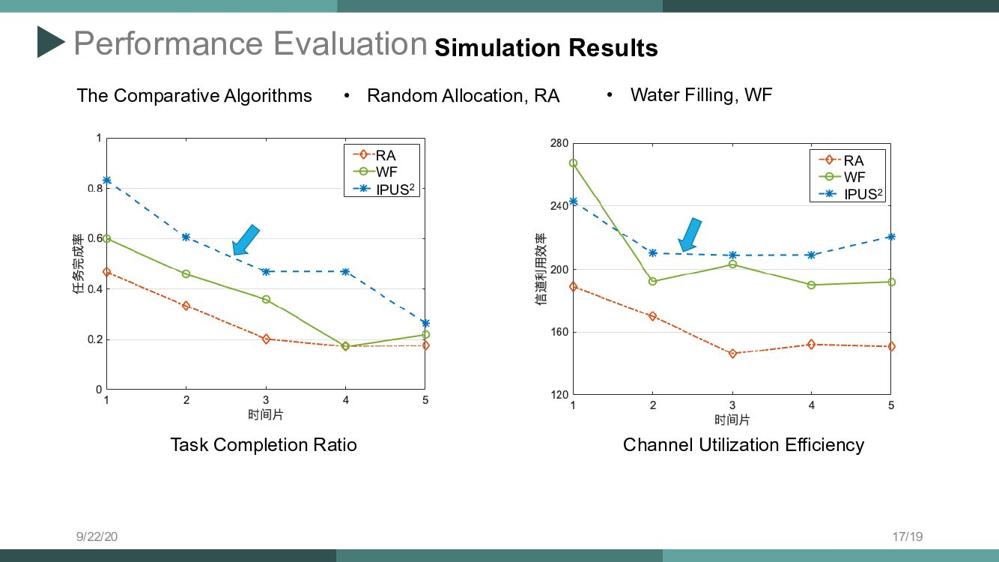
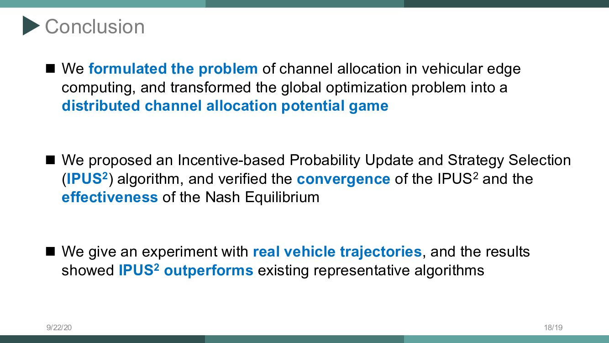


## 引用本文

```bibtex
@article{xu2021potential,
	language = {Chinese},
	copyright = {Compilation and indexing terms, Copyright 2022 Elsevier Inc.},
	copyright = {Compendex},
	title = {Potential Game Based Channel Allocation for Vehicular Edge Computing},
	journal = {Tien Tzu Hsueh Pao/Acta Electron. Sin.},
	author = {Xu, Xincao and Liu, Kai and Liu, Chunhui and Jiang, Hao and Guo, Songtao and Wu, Weiwei},
	volume = {49},
	number = {5},
	year = {2021},
	pages = {851 - 860},
	issn = {03722112},
} 
```

```bibtex
@article{xu2021potential,
  	author={许新操 and 刘凯 and 刘春晖 and 蒋豪 and 郭松涛 and 吴巍炜},
	title = {基于势博弈的车载边缘计算信道分配方法},
	publisher = {电子学报},
	year = {2021},
	journal = {电子学报},
	volume = {49},
	number = {5},
	eid = {851},
	pages = {851-860},
	keywords = {车载边缘计算;信道分配;势博弈;分布式调度},
	doi = https://www.ejournal.org.cn/CN/10.12263/DZXB.20200994
}

```

